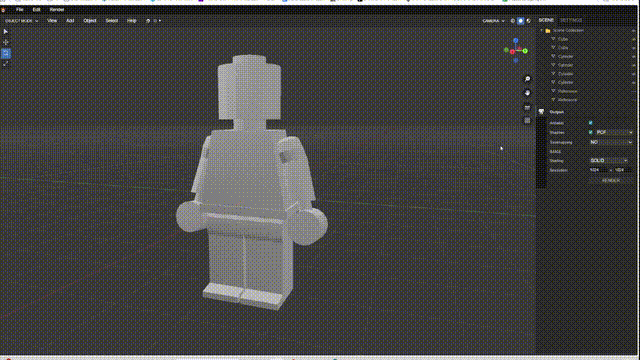
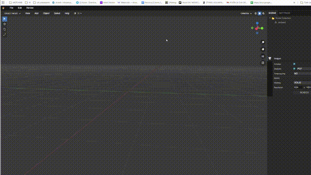

# Weblend

**Weblend** is a passion project born from a deep love for **Blender** and the power of modern web technologies.

## 👨‍💻 About the Author & The Vision

Hi, I'm **Andrea Rotondo**. I have been a passionate **Blender** enthusiast since version **2.43**. Over the years, I've watched **Blender** evolve into the industry standard it is today, and that evolution has always inspired me.

Combining my experience in **JavaScript, WebGL, HTML, and CSS** with the cutting-edge assistance of **Gemini AI**, I set out to answer a question: *Can we bring a true, Blender-like modeling experience to the web?*

The result is **Weblend**.

## 📺 Feature Demonstrations

### 🪞 Real-time Mirror Modifier
The Mirror modifier allows for non-destructive symmetry modeling, updating the mesh instantly as you work.


### 🔼 Extrude Tool
Replicating one of the most fundamental modeling operations, the Extrude tool lets you grow your geometry with precision.


### 📥 Model Import
Easily bring your existing assets into the scene with support for standard 3D formats.


## 🌟 Inspired by Blender

**Weblend** isn't just a 3D viewer; it's a tribute to the **Blender** workflow. It aims to recreate the feeling of power and flexibility that **Blender** users love, right inside the browser.

You will find familiar concepts everywhere:
- **Modifier Stack:** Just like in **Blender**, we have a non-destructive workflow with modifiers like *Mirror* and *Array*.
- **Edit Mode:** Vertex, Edge, and Face manipulation that feels right at home for **Blender** veterans.
- **Tools:** The Knife, Loop Cut, Extrude, and Bevel tools are designed to mimic their **Blender** counterparts.

## 🚀 Status: Moving Fast!

There is still a lot to do to catch up with the giant that is **Blender**, but development is proceeding **extremely fast**. Thanks to the synergy between my coding skills and **Gemini**, features are being added and refined rapidly.

### ✨ Latest Updates
- **Subdivision Stability:** Fixed geometry artifacts and "face splitting" during extrusion with the Subdivision Surface modifier by implementing a topological winding check and optimized vertex merging.
- **Dynamic Shading Fix:** Corrected the "Shade Smooth/Flat" commands to properly respect the active Modifier Stack, ensuring the mesh remains subdivided when changing shading modes.
- **Extrude Refinement:** Improved the Extrude tool to automatically inherit material indices and UV properties, ensuring visual consistency on newly created side faces.
- **Advanced Mesh Merge:** Added "Merge" options (At Center, At Cursor, Collapse, At First, At Last) in Edit Mode, bringing a more complete Blender-like modeling experience.
- **Improved UI Layout:** Reorganized the Menubar for better accessibility; the "Mesh" menu is now conveniently located next to "Render" and "Add".
- **Enhanced Data Stability:** Fixed a critical `DataCloneError` in the IndexedDB storage system by implementing an automatic data sanitization layer, ensuring projects are saved reliably.
- **Subdivide Operator:** Divide your geometry with precision using the new Subdivide command in the Edit Mode context menu, complete with an adjustable Operator Panel.
- **Decimate Modifier:** Optimize your meshes with the new Decimate modifier, allowing you to reduce face count while preserving shape.
- **Merge by Distance:** Clean up your topology with the "Merge by Distance" tool (Mesh > Clean Up), perfect for removing double vertices.

## 🛠️ Technology Stack
- **Core:** Vanilla JavaScript (ES6+) & WebGL
- **UI:** HTML5 & CSS3 (Custom UI system)
- **AI Partner:** Powered by **Gemini**

## 💬 Community & Support

Join the conversation and stay updated:
- **Facebook Group:** [Blender 3D Italia & Weblend](https://www.facebook.com/groups/134106979989778)
- **Discord Server:** [Join our Discord](https://discord.com/channels/691583809640202251/691583810327805974)

## 📂 Project Structure
1. **Clone the repository:**
   ```bash
   git clone https://github.com/wox76/weblend.git
   ```
2. **Run it:**
   Simply open `index.html` in your browser.

## 📄 License

This project is licensed under the **MIT License**.

## 🤝 Credits & Inspiration

- **Weblend** is inspired by the [kokraf](https://github.com/sengchor/kokraf) project by Seng Chor.
- Dedicated to the open-source community and Blender users everywhere.